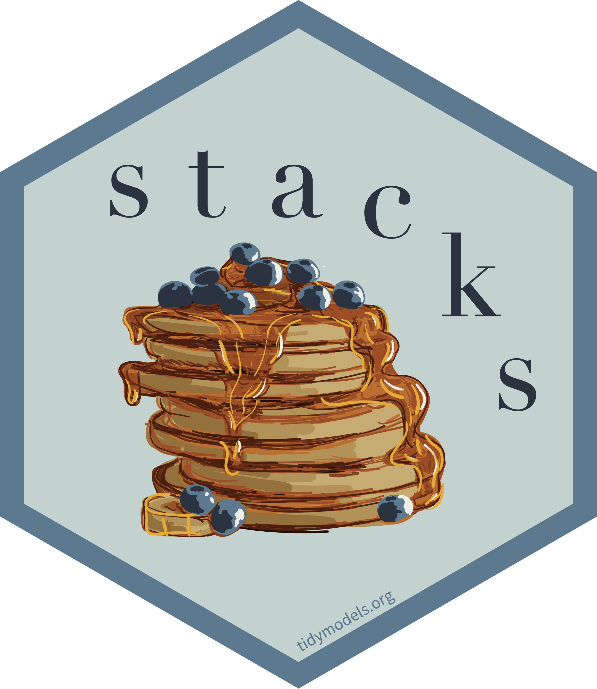
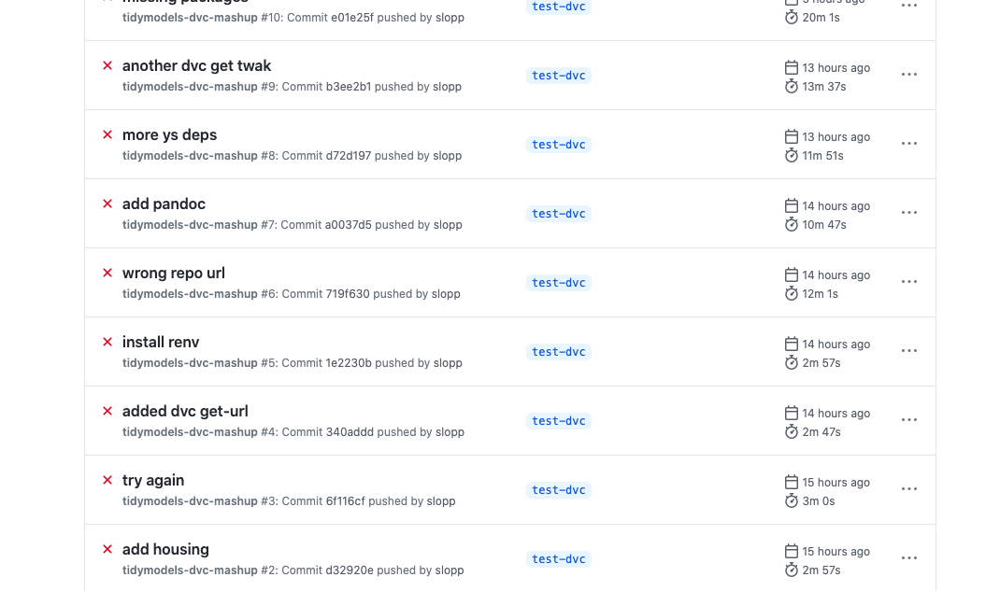
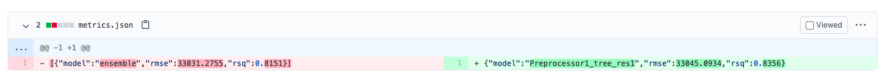
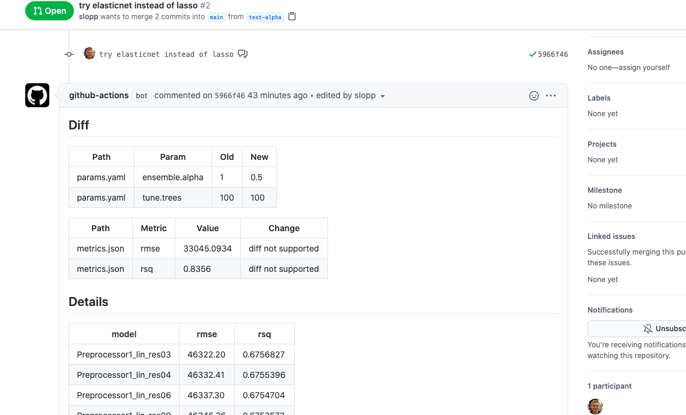
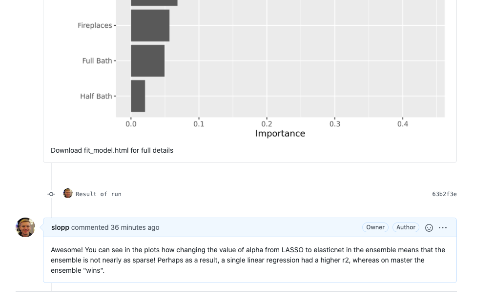

```{r setup, include=FALSE}
knitr::opts_chunk$set(echo = TRUE)
```

I had a few goals in my first few days of vacation:

1.  Figure out GitHub Actions.
2.  Try out [`tidymodels`](https://tidymodels.org) , after being inspired by a R in Pharma talk on the `stacks` package.
3.  Investigate this whole MLOps thing, and by investigate I meant *try it*, I did NOT go on vacation to read more Gartner Garbage ™️ .

As luck would have it, [\@DrElleOBrien](https://twitter.com/DrElleOBrien) happened to reach out about trying [DVC](https://twitter.com/DrElleOBrien) with R. DVC is a framework for MLOps that can use GitHub actions, so I had the perfect excuse to knock out all three goals with one sample project.

If you don't want the rambling story, here is the project: <https://github.com/slopp/tidydvc>.

## Background

### DVC

[DVC](https://dvc.org), and its close companion [CML](https://cml.dev), provide tools for model management - think Git for data and models. The core idea is that a DVC pipeline tracks the input (files, data, hyper-parameters) to an experiment and the output of an experiment (model, metrics, etc). DVC can be used locally, but the real magic is that DVC can be combined with something like GitHub and GitHub actions to automate the experiment management. Just like a software engineer could create a PR to propose a change to code, a data scientist could create a PR to propose a change to a model. But, unlike in software engineering where the goal of a PR is to review and automatically test code changes, in ModelOps the goal of the PR would be to train a model and explain the outcome!

DVC is primarily built around Python, but I wanted to see if it could be used with R. In many ways it shares some of the principles of the `drake` (now `targets`) package, but with some added Git ✨.

### Tidymodels

[Tidymodels](https://tidymodels.org) is an opinionated workflow for model construction in R[^1]. It is kind of like scikit learn in the sense that many different algorithms are presented with a consistent interface.

[^1]: Tip: it is <https://tidymodels.org> NOT [https://tidymodels.com...](https://tidymodels.com…)

A few interesting bits about tidymodels:

1.  There is a concept of a `workflow` that allows you to track a model's pre-processing steps and the model itself in one easy-to-use object. This turns out to be super helpful, though a bit at odds with DVC (or drake)'s concept of a pipeline... more to come.
2.  There are easy ways to `tune` hyper-parameters. Again, very helpful, but potentially at odds with external ModelOps-y things that want to control those elements.
3.  There is experimental support for [ensembles](https://github.com/tidymodels/stacks), which is what I wanted to try!

{style="width: 194px"}\

### Mashup 

Aside from learning the individual pieces, I wanted to see if it was possible to glue these different ecosystems together. As I hinted at above, however, there were some surface level concerns. It wasn't clear to me if I could define clean boundaries between the concepts `tidymodels` wanted to control and what DVC expected to own. But the goal of PRs with beautiful `ggplots`was enticing. (Famous last words).

Final note, I also enjoy using R Markdown as a framework for data exploration and model creation. I find R Markdown encourages "thinking while coding". I definitely wanted R Markdown to play a role.

If you are interested in this type of mashup but want to play mostly in R, I highly recommend this article by David Neuzerling: [Machine Learning Pipelines with Tidymodels and Targets](https://mdneuzerling.com/post/machine-learning-pipelines-with-tidymodels-and-targets/).


## Unstacking Stacks

I began by creating an R Markdown document that roughly followed the outline of this [stacks tutorial](https://stacks.tidymodels.org/articles/basics.html). To spice things up, I decided to use the Ames Housing data, so my goal was to create an ensemble that predicted housing prices. You can follow the [code here](https://github.com/slopp/tidydvc/blob/main/fit_model.Rmd). Because one of my goals was to try tidymodels, here are some notes for future me on what I learned.\
\

### Don't skip EDA

I didn't want to just copy code from Max's [parsnip regression tutorial](https://www.tidymodels.org/learn/models/parsnip-ranger-glmnet/) so instead I opted to write my own formula regressing on different predictors[^2]. I thought I could do this without any EDA. MISTAKE. I lost at least 2 hours fighting models that wouldn't converge because my data was either incomplete or my pre-processing was non-sensical. I still am not happy with the results, but I did learn a valuable tactic. *When defining a recipe that will be used further down the line in a workflow, it is still a good idea (though not required) to prep and juice the recipe.* Essentially, this optional juicing allows you to SEE how the recipe is applied to your training dataset and troubleshoot any errors in a friendly space, as opposed to an unfriendly space (which is what I call a stack trace from the middle of a cross validation optimization routine that has failed because of a `NA`).

[^2]: My ultimate model did outperform the models in that tutorial .... but lets all admit tutorial models are garbage and safely move on. Lest we get stuck on wondering why folks in Iowa value garage spaces over lot size.

```{r eval=FALSE}
# First define the recipe
housing_rec <- recipe(SalePrice ~ ...) %>% 
  update_role(PID, new_role = "ID") %>% 
  step_dummy(all_nominal()) %>%  
  step_meanimpute(all_numeric()) %>% 
  step_zv(all_predictors()) %>% 
  step_nzv(all_predictors())

# Check it!
housing_rec %>% 
  prep() %>% 
  juice()

# Then do the rest of your workflow magic
housing_wflow <- 
  workflow() %>% 
  add_recipe(housing_rec)
```


*Tune*

Tuning is easy. Getting the model out of the tune to actually use... a little less intuitive. As with all things, I should have started by reading [Julia Silge's advice](https://juliasilge.com/blog/sf-trees-random-tuning/). Essentially there are a couple things you (future me) need to know:

1.  You create a model spec and stick it in a workflow:

```{r eval=FALSE}
# PS - for those who learned penalized regression through glmnet
# penalty = lambda 
# mixture = alpha
model_spec <- linear_reg(penalty = tune("penalty"), mixture = tune("mixture"))

# the workflow ties your model to your pre-processing
model_wflow <- 
  workflow() %>% 
  add_recipe(preprocess_data) %>% 
  add_model(model_spec)
```


2.  You can tune the model[^3] using a grid:

[^3]: I am going to use model and workflow as synonyms for the rest of this section

```{r eval=FALSE}
tune_results <- 
  tune_grid(
    model_wflow,
    resamples = folds,  
    metrics = metric,  # think rmse
    control = control_grid() # controls what metadata is saved 
  )
```


3.  You can look at the tuned results:

```{r eval=FALSE}
# hint use the n function argument to see more. This is where you can find the actual tune parameters
show_best(tune_results)
```


4.  BUT, at this point, *you have to finalize the actual best model*. Or in the case of an ensemble, you have to finalize *many* models. Finalize means take the tuned parameters and fit the model on ALL the training data. (The parameters come from a model fit on a cross validation fold). To do this:

```{r eval=FALSE}
# select_best was counterintuitive to me... I found it hard to pull the data
# for all models; and it doesn't give you the best model, just the best
# tune parameters 
tuned_params <- select_best(tune_results)

# use this object for future predictions
model_wflow_fit <- finalize_workflow(model_wflow, tuned_params)

# final tip: to inspect the actual model 
model_wflow_fit %>% 
  pull_workflow_fit() %>% 
  broom::tidy() # linear models OR
  vip::vip() # trees
```


At different points of this process it can be easy to forget what is trained and what is still a placeholder. The print methods are really good, use them.


### Stacks

My final goal was to fit an ensemble model. Unfortunately, I hit an error using the `stacks` package. I suspect this error was due to the fact that the package is experimental and I had some stale dependencies. This left me between a rock and, well, another rock. I could have tried to nuke my environment and fight with `remotes` to install a bunch of development tidymodels packages. (This was made harder by the WIP change to `main` from `master` 👏). Or I could try to push forward by working around the error with my own ensemble code. I went for the latter path, and refreshed a lot of my statistical thinking along the way. (Recall `%*%` is how to do matrix multiplication in R). But I also killed 5 hours of vacation. 🤷 I will spare you and my future self the details in the hope that the error is fixed, but a few conceptual tips:

1.  The `stacks()` object starts with candidate models (from `tune_grid`) or a single model but with multiple fits (from `fit_resamples`). The magic this function does is align the different models based on the resample they used. In other words, if one candidate was fit on resample 1, it is matched with another candidate fit on resample 1. The same matching occurs within tuning configurations from a single model.\
2.  Under the hood, the ensemble is fit with glmnet, but buried in quite a few layers of tidymodels abstraction. `cv.glmnet` works as an alternative, but with a nasty side affect. You have to do all the work manually to get a final fitted object that glues all the prior models, workflows, and the ensemble together.\
3.  When those nice print methods I mentioned earlier fail, try `attributes` to see "all the stuff" tidymodels is carrying around.

## **The Mashup**

### Adding DVC
\
*Once I had a functional R Markdown document that was fitting models, it was time to try this ModelOps thing. Now ModelOps can consist of a lot of things, but in this case I was interested in trying out the training side of model operations - tracking experiments and enabling collaboration. I'll save the monitoring side - deploying models to production and watching them overtime - for another vacation.

DVC is oriented around pipelines. Unfortunately, this appeared to clash a bit with my R Markdown workflow. For one, the R Markdown document "drove" all the modeling code, and this code was not amenable to being managed by an external pipeline. Another problem was that the tidymodels packages, especially `tune` and `stacks,` handled the parameters and "experiments" that DVC wanted to control.\
\
I decided to mostly ignore the first challenge. If my data was large, or the pre-processing intense, I think I would have benefited from breaking the R Markdown document into child documents that could each be a stage in a pipeline. In this case, I didn't care for the extra overhead in saving intermediate results, and things were fast enough that I didn't mind re-running steps from scratch. As I mentioned, I am advocate for using R Markdown instead of .R files even in the multi-stage approach. You an see an example of this ["split it up" approach here](https://github.com/sol-eng/bike_predict).

For the second problem, I decided to go with a hyper-hyper-parameter strategy. Essentially, I allowed `tune` and tidymodels to handle the hyper-parameter optimization within a model, but I used DVC to handle "parameters" that would fundamentally change the type of model at play. In other words, my "PR experiments" amounted to asking questions like "what if our ensemble uses ridge regression instead of LASSO?" as opposed to questions like "what if each forest has more or less trees?". Is this splitting hairs? You betcha. In fact, you can see artifacts in the code where I did use DVC for "\# of trees" and where I attempted to use the tidymodels code for optimizng the ensemble. My advice: "experiments" in most ModelOps settings come with overhead and complexity, so use them to track whatever changes really matter to you.

> In the current sate of MLOps, there aren't great boundaries.

I think this article explains this [nascent border-less state well](https://towardsdatascience.com/the-problem-with-ai-developer-tools-for-enterprises-and-what-ikea-has-to-do-with-it-b26277841661?gi=1a3a6ab5f7e7).\
\
One artifact of my toy exploration is that I also punted a bit on questions of scale. One of the claims of ModelOps is that, when adopted correctly, the training portion of experiments can easily be scaled across a wide variety of backends. I'll leave that test for another day, but in my experience "magic parallelism" is almost always a lie.

### Pipeline Iteration

{style="width: 435px"}

After settling on how I wanted to incorporate DVC into my example, it was time to try and get GitHub Actions working. This is where I thought my expertise in R package management would come in handy. I was right and wrong. On the plus side, I was successful. On the other hand, it was still hard.\

Here are a few tips and tricks:

1.  Elle created an [action workflow](https://github.com/elleobrien/actions_with_r) that showed me how to use the [`r-lib` Github actions](https://github.com/r-lib/actions) to install R in the context of a CML pipeline. Unfortunately, the r-lib actions are geared towards people testing packages, not people just running code. This discrepancy made our use case a bit awkward. In the future there will hopefully be actions geared at using R to simply run code.\
2.  I created an R script to wrap my `render::rmarkdown` call. This script did two things. First, it set the R repo option to use [Public Package Manager](https://packagemanager.studio.com) to provide pre-built package binaries. This rapidly speeds up package install time. Second, the script calls `renv::restore`, which installs the packages I needed for my project. [renv](https://github.com/rstudio/renv) is like the R equivalent to `pip freeze; pip install -r requirements.txt` .\
3.  Even though I was using pre-compiled R package binaries, some of them still had runtime system requirements. This meant I had to add a number of `apt-get install thing` lines to the actions file. I should have known this ahead of time and used Package Manager to identify what those requirements would be, but instead I did it the "old fashioned" (read: painful) way of failing again and again until it worked.

Overall, I think if I was doing a project like this for real, it'd be well worth my time to create a custom Docker image with my project environment and have the GitHub Action start by pulling that image. Otherwise you end up spending valuable iteration time waiting for the same packages to be installed.\
\
I also think this experience highlights the importance of local testing and experimentation. Running `dvc repro` to try out experiments locally was significantly faster for both troubleshooting and model exploration than waiting for the CI system to run. It is also much easier, locally, to explore metrics around model fit or interpretation that you may have forgotten to have your CI system write out. What this means:

1.  Before CI/CD can be real for ModelOps, CI systems will need to be optimized for model operation performance.\
2.  Model management tools, like DVC pipelines, can be useful for organizing experiments and collaborating with others even without the CI part.\
3.  If you do go the CI route, remember that the environment is ephemeral, so be sure to save persistently *everything and anything* that might be useful for interactive debugging, model interpretation, etc later on.

In general, I think we are a ways away from collaborating as seamlessly as software engineers do through Git. But, the state of the world is much much better than tracking model runs manually in a spreadsheet!\
\

### The Magic Moment

> *"There is nothing quite as joyous as the rush one gets from a pipeline building when it had been failing" -every software engineer and soon every data scientist too*

This [PR shows you the results](https://github.com/slopp/tidydvc/pull/2), and here are a few of the happy screenshots:






