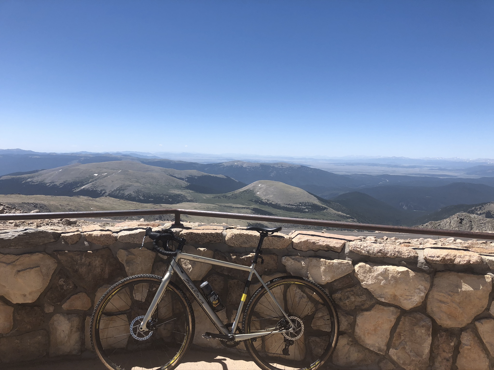
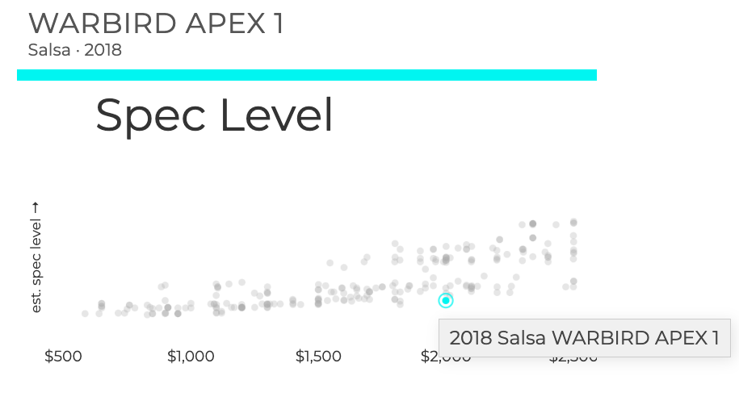
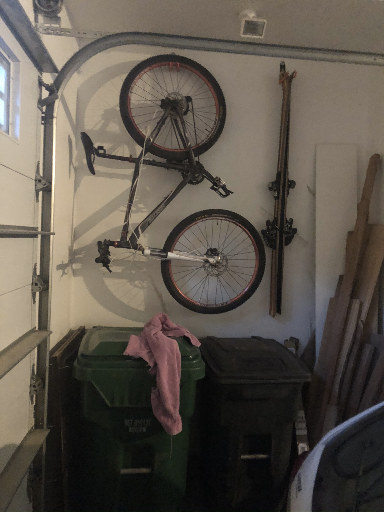

```{r setup, include=FALSE}
knitr::opts_chunk$set(echo = FALSE)
```

The saying goes the number of bikes you *need* is `n+1`, or 1 more than the number you currently have. But a few years back a colleague of mine proposed a different formula. He suggested that `n=1` where that one bike is a "dropper knobby tire cross between a cross bike and an endurance road bike".

I, at the time believing `n+1`, was sold. After convincing my wife, I sought out such a bike and landed on a 2018 aluminum Salsa Warbird which would subsequently be named Chuck.

{style="width:397px"}

For those of you interested, the original spec [sheet is here](https://salsacycles.com/bikes/archive/2018_warbird_apex_1). The [99 spokes comparison](https://99spokes.com/compare?bikes=salsa-warbird-apex-1-2018) looks like this:

{style="width:702px"}

<aside>

At the time I didn't know about 99 spokes. Now I do, and now so do you! If you are a bike AND data person, the site is an absolute must.

</aside>

Over the years Chuck has stayed mostly the same, aside from an upgraded cassette and the addition of tubeless tires. About two years later, was my colleague right? Does `n=1`?

### For `n=1`

This bike is fun because it lets you link together rides that otherwise aren't easy to accomplish. For example, one of my favorite rides involves a 3 mile gravel road, 14 miles of canyon climbing, a quick mile of single track at the top of the canyon, and then 14 rapid miles of descent home. That combination is hard to beat.\
\
This bike is also durable. I *love* the 1x SRAM Apex groupset. It is shocking how much mental effort goes into the debate "Should I switch the front ring or the back? If I do shift the front, how much should I adjust the back". This 1x system lets you forget all of that. The rear derailleur is easy to adjust, and is simple enough to fix (when you break the derailleur hanger 😥), and it comes with a super handy 🔒 mechanism that will detension the chain making everything easy.

<aside>

I hear rumors that some electric shifters also get rid of that thought, but I don't believe in bikes that need to be charged, even for shifting purposes.

</aside>

**But is it too heavy and slow for the road? Is it too stiff for the trails?** In short: no. It is fast enough to hang on most roadie group rides, and it turns easy single track back into a challenge.

The most damning evidence for this side of the debate: when it came time for my Dad to buy his *one* bike, I got convinced him to go with the very similar, slightly less aggressive, Salsa Journeyman. I will admit, if you are more like my wife, you may prefer to skip the drop handle bars and go with commuter bars for comfort.

### Against `n=1`

The most damning evidence against this case: since purchasing Chuck I have purchased another bike.... meet Charles (a bit more sophisticated, eh?)\

{style="width:415px"}

So why did I buy Charles? The short answer is because I was planning (and have done) some pretty serious road rides; e.g, I hope to do the Triple Bypass. The longer answer involves Strava PRs and a disdain for the "they have a lighter bike" excuse.\
\
Charles is a different ride than Chuck. I quite enjoy the transition, switching from Chuck to Charles feels like hoping on a 🚀. And when I'm tired of grinding hills, it is fun to hit the dirt on Chuck. Chuck also takes the brunt of off-weather rides, meaning that Charles stays clean and mostly maintenance free.

<aside>

Charles spends a greater part of the winter on a trainer

</aside>

So whether you want to believe `n=1` or not, I can highly recommend both bikes. Ride more, talk about riding slightly less.

### PS

This post would feel a bit incomplete if I didn't introduce you to the final member of the fleet: Charlie. Charlie was my high school mtn bike turned college commuter turned emergency backup. Most of Charlie's time these days is spent like this:

{style="width: 204px"}
