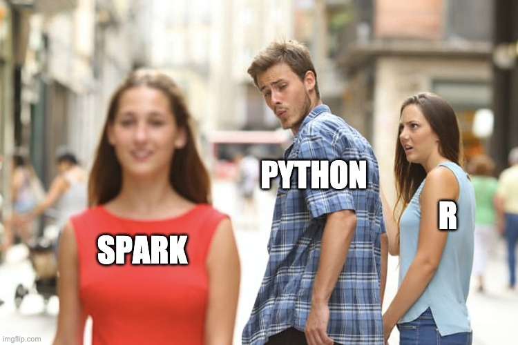

```{r setup, include=FALSE}
knitr::opts_chunk$set(echo = TRUE)
library(tidyverse)
library(lubridate)
```

{style="width: 359px"}

I've written about how R and Python can be used together:

-   [in a platform](https://loppsided.blog/posts/2020-10-18-hamburgers-at-chick-fil-a/)

-   by [package authors writing multilingual wrappers](https://blogs.rstudio.com/ai/posts/2019-08-29-using-tf-from-r/)

-   by [individuals in an analysis](https://rviews.rstudio.com/2018/04/17/reticulated-shiny/)

Recently I was presented with a challenge that was well suited to Spark and forced me to think about the R and Python "love story" at scale. Or in other words, could R and Python be used together in a **ML engineering context** that values performance and scale?

If you are fuzzy on the differences between analyst and ML engineer, I highly recommend Cassie Kozyrkov's breakdown[^1]. My goal in this post is to show you some tricks that can help a multi-lingual analyst approach an ML engineering task by taking advantage of both Python and R.

[^1]: Google's Chief Decision Scientist. Essentially, her point is that analysts value speed, statisticians value rigor and correctness, and ML engineers value performance. So in this case, my question is whether R and Python can be used together in a performant and scaled way, not just to enable speedy data exploration and hypothesis discovery.

## The Setup

Imagine you've got customer data in a time series:

```{r echo=FALSE}
data <- tibble(
  customer = c(rep("cust_A", 5), rep("cust_B", 5), "cust_C"),
  time = c(ymd_hms("2019-01-15 08:00:00") + minutes(seq(0,60, 15)), 
           ymd_hms("2019-03-20 11:30:00") + minutes(seq(0,60, 15)),
           ymd_hms("2019-10-11 22:45:00")),
  water_flow = sample(seq(0,20, 0.25), 11, replace = TRUE),
  customer_type = c(rep("business", 5), rep("residential", 5), "business")
)
data
```

Now imagine, additionally, you've done some feature engineering and built a model. In this case, say our model is attempting to predict whether or not a customer is a business or a residential water user.

On many data science teams, you may have Python code that looks something like this:

```{python echo=TRUE, eval=FALSE}
import pandas as pd
from scipy.signal import find_peaks
import numpy as np
from sklearn.linear_model import LogisticRegression

training_data = pd.read_csv("water_data.csv")
num_customers = len(training_data.customer.unique())

# take the time series and generate
# one feature row per customer
num_peaks = np.zeros(num_customers)
max_water_off_hours = np.zeros(num_customers)
max_water_abs = np.zeros(num_customers)

for c in 1:num_customers:
  customer = training_data.customer.unique()[c]
  this_customer = training_data[training_data.customer == customer]
  # use a cool scipy algorithm
  peaks, _ = find_peaks(this_customer.water_flow)
  num_peaks[c] = len(peaks)
  # some simpler feature generation
  hour = this_customer.time.hour
  max_water_off_hours[c] = max(this_customer.water_flow[hour < 8 | hour > 17])
  max_water_abs[c] = max(this_customer.water_flow)
  
X = pd.DataFrame.from_dict({
  'num_peaks': num_peaks,
  'max_water_off_hours': max_water_off_hours,
  'max_water_abs': max_water_abs
})

y = (training_data.groupby("customer")
  .customer_type
  .agg(lambda column: pd.unique(column)))

model = LogisticRegression().fit(X, y)
```

So here is the big setup: **What if you need to score 1 million customers? And what if your expertise is in R?**

One way to frame the second condition of the questions is what if, as an analyst, you are comfortable with some Python and some R but not all that comfortable with PySpark? Have no fear, this blog post has the tips for you!

## Why Spark?

Spark is a natural fit for this example (and other problems like it) for a few reasons:\

1.  The data really is BIG. In this case, if each customer is a time series with data every 15 minutes, in a year a customer would generate 35K rows of data. 1M customers would generate close to 35 billion rows of data in a year. With data this size, feature generation in a loop would be tricky.\
2.  The data is well suited to partitioning. In this case, each customer is still relatively small, and assuming the customers are independent, you have a very natural map reduce problem. In laymen terms, this means the problem is easy to break into small pieces. We could write parallel code ourselves, but if you have big data that is easy to break into small pieces, than the Spark ✨ is really just that it will do the parallelization for you!

## The Love Story Challenge

Unfortunately the average data analyst, asked to translate the code above into Spark, could be stumped. And this is where I will make a bold statement. In this case, combining R and Python with a few tricks lets you accomplish the ML engineering task.

## Tips and Approach

**Step 1: For local testing, get Spark installed and running.**

For this step, I find the R toolchain to be really well suited to the task:

```{r eval=FALSE}
library(sparklyr)
spark_install()
```

**Step 2: Feature Transforming using dplyr**

As a bilingual analyst, this is where we can start to cash in on some sparklyr magic. Even though the original feature transformation code is in Python, we can use dplyr in R to quickly generate the Spark SQL equivalent:

```{r eval=FALSE}
# connect to our dev spark environment
sc <- spark_connect(master = "local")

# take our Python for loop and turn it into a 
# dplyr chain
training_data <- spark_read_csv("water_data.csv")

features <- training_data %>% 
  group_by(customer) %>% 
  mutate(hours = to_hour(time)) %>% 
  mutate(
    off_hours = as.numeric(hours < 8 | hours > 17),
    max_water_off_hours = max(water_flow * off_hours), 
    max_water_abs = max(water_flow)
  )

dbplyr::sql_render(features)
```

    SELECT `customer`, `time`, `water_flow`, `customer_type`, `hours`, `off_hours`, MAX(`water_flow` * `off_hours`) OVER (PARTITION BY `customer`) AS `max_water_off_hours`, MAX(`water_flow`) OVER (PARTITION BY `customer`) AS `max_water_abs`
    FROM (SELECT `customer`, `time`, `water_flow`, `customer_type`, `hours`, CAST(`hours` < 8.0 OR `hours` > 17.0 AS DOUBLE) AS `off_hours`
    FROM (SELECT `customer`, `time`, `water_flow`, `customer_type`, to_hour(`time`) AS `hours`
    FROM `training_data`) `dbplyr_001`) `dbplyr_002`

**The first key trick:** Sometimes when you are writing dplyr that executes against a Spark data frame, you want to use native R functions, especially in your `mutate`. Sometimes these R functions work magically, sometimes they do not. In general, you can see what R functions will magically make the trip to Spark SQL [here](https://spark.rstudio.com/dplyr/#sql-translation). If your function isn't on the list, fear not. Often there is a Hive UDF that will do the trick. Think of a Hive UDF as a special function you can use in spark-flavored dplyr. The list of these functions lives [here](https://cwiki.apache.org/confluence/display/Hive/LanguageManual+UDF), and in this example we use `to_hour`. **\
\
The second key trick**: You can now take this SQL and use it in a different context. In our example, we will need to use a Python UDF (see below) to capture the `find_peaks` feature transformation. This means our final Spark instructions will need to run in Python. But we don't need to learn all of PySpark, we can take our dplyr-generated Spark SQL and use in Python like so:

```{python eval=FALSE}
sc = (SparkSession
  .builder
  .appName("DetermineWater")
  .getOrCreate())


# read our data directly into spark
training_data = (sc.read.options(header=True, inferSchema=True, delimiter=",")
  .csv("water_data.csv"))

# take our spark data frame and create a view that we can execute SQL against
training_data.createOrReplaceTempView("training_data")

# embed our direct-from-dplyr SQL
# WOW isn't it still nice and readable :) 
feature_query = """
SELECT `customer`, `time`, `water_flow`, `customer_type`, `hours`, `off_hours`, MAX(`water_flow` * `off_hours`) OVER (PARTITION BY `customer`) AS `max_water_off_hours`, MAX(`water_flow`) OVER (PARTITION BY `customer`) AS `max_water_abs`
FROM (SELECT `customer`, `time`, `water_flow`, `customer_type`, `hours`, CAST(`hours` < 8.0 OR `hours` > 17.0 AS DOUBLE) AS `off_hours`
FROM (SELECT `customer`, `time`, `water_flow`, `customer_type`, to_hour(`time`) AS `hours`
FROM `training_data`) `dbplyr_001`) `dbplyr_002`
"""

features = sc.sql(feature_query)
```

**Step 3: Python UDFs**

Now that we have the features we can generate from SQL (thanks to our dplyr trick), it is time to turn to the `peaks` feature that comes from the `scipy` `find_peaks` function. We could approach the peaks transformation at scale in a few ways:

-   We could try to find a built-in Spark equivalent to `find_peaks`

-   We could try to write a SQL equivalent ourselves

-   We could use a "user defined function" to execute the Python code in Spark

Option 3 is a good choice here thanks to the recent work by the [Arrow Team](https://ursalabs.org). There is now the option in Spark to efficiently run a Python function that takes in a data frame partition (a small piece of our BIG data) and returns a data frame, and it is all done as-if the input and output were pandas data frames. Here is what the code looks like:

```{python eval = FALSE}
# a regular python function that takes a pandas dataframe and 
# returns a pandas dataframe
def peak_finder(this_customer):
  peaks, _ = find_peaks(this_customer.water_flow)
  return(
   pd.DataFrame.from_dict({
    'customer': this_customer.customer[0]
    'num_peaks': len(peaks)
   })
  )
  
# this is the only weird part, we have to give spark
# more info about the data frame we'll be returning
schema = "customer string, num_peaks int"

# call the magic, Spark dispatches the Python function
# taking advantage of the per customer partition 
peaks = (training_data
  .groupby("customer")
  .applyInPandas(peak_finder, schema = schema))
  

```

With `peaks` and `features` both at hand, we could create a final `features` Spark data frame using `join`.**\
\
Final Step : Model (Re)Fitting and Scoring**

A benefit of Spark is that it provides some ML capabilities out of the box that the analyst might already be familiar with. In this hypothetical case we could do two things:

1.  If we were happy with our trained model, we could just apply the coefficients the old fashioned way to our BIG data in Spark by writing code that looks like `y = coef*X1 + coef*X2 …` . (Or for a logistic regression, $y = \frac{e^{X\beta}}{1 + e^{X\beta}}$ ).
2.  If we wanted to train a new model, we could take advantage of Spark's own logistic regression, which is purpose built for fitting model coefficients in the case where the total data (1M customers minus a holdout) is too big for your local machine.

Now that we have the pseudo code to make our concept work in Spark, scaling is as easy as: (1) reading in a folder of csvs instead of a single csv, (2) connecting to a real Spark instance instead of our local development instance, and then (3) scaling the cluster horizontally and tuning our spark commands to take advantage! Ok, I know, this last sentence may feel a bit like "draw the owl", but a blog post can only contain so many 💎.

## Conclusion

Multilingual data science can make you a ninja. Two tricks in particular are really powerful: `dbplyr::sql_render` and `applyInPandas`. Combining these tactics from different languages allows the regular data scientist to achieve ML engineering status: performance at scale. In this case, I think it is fair to say that R and Python are compatible with Spark, and I might go so far as to say Spark is an aphrodisiac to the multilingual love story.
