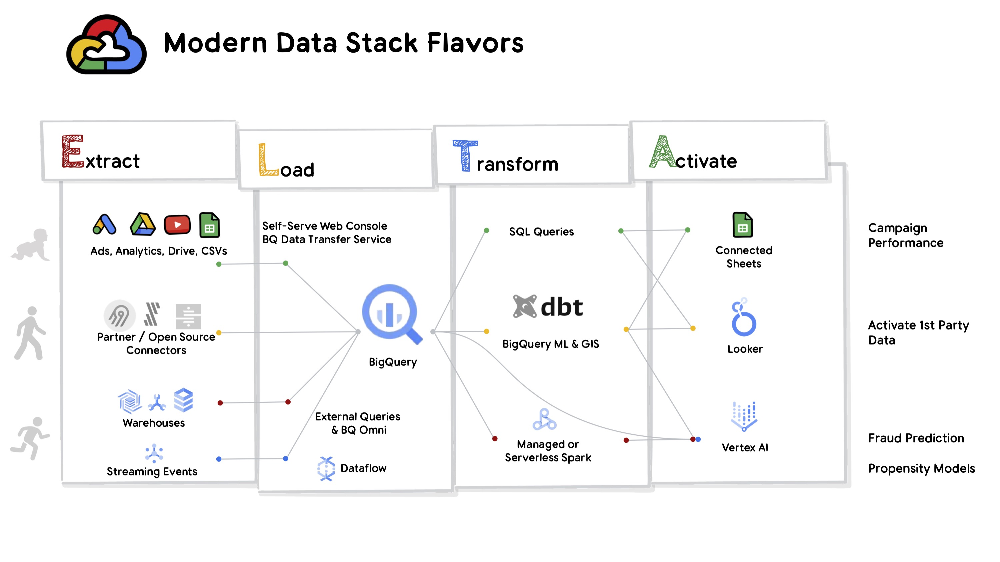

```{r setup, include=FALSE}
knitr::opts_chunk$set(echo = FALSE)
```

**Unfinished post**\
\
*I decided this post was a bit too... uh.. pandering I guess? I want posts that future me will find useful, and that usually means they need to demonstrate an implementation. This post is more "all talk, no walk". While landscapes can be useful, I didn't see further ROI in flushing out this outline. That said... I made a picture... I'll unscrupulously put it online.*\
\
I get unreasonably excited about maps, especially [maps of technology landscapes](https://mattturck.com/data2020/). The challenge with maps is always the granularity. How far do you zoom in? Too broad a map is useless, but too narrow a map might leave out key alternative routes. In the data space, there are [many great maps](https://www.youtube.com/watch?v=0uBWluKGPNk) around the evolving "modern data stack". Unfortunately I think many of those maps are too zoomed in. For the past few months I've struggled to rectify discussions about the modern data stack with an onslaught of VC fundraising and valuations[^1]. Where does the billion dollar Databricks fit into the dbt narrative about analytic engineers? How does Snowflake continue to beat expectations despite having a single product - not a stack?

[^1]: It may be a fool's errand to try and rationalize anything to do with market valuations. If it turns out we're in a mega-bubble than rest assured I'll be the first to throw out all of the maps.

I believe there are actually 4 modern data stacks. In this post I'll unpack a map of these 4 modern data stacks, I'll defend a few key omissions, and I'll also explain why I'm especially bullish on Google's position in this landscape.

*Disclaimer*: I work for Google Cloud. While I've certainly drunk some Koolaide, many of the arguments I make in this post are reasons I joined Google not just evangelical marketing I've internalized. **This post represents my own views and not that of my employer** - everything here is speculative!

*Thank yous*: Many existing maps inspire mine, especially those drawn by [Tristan Hardy](https://blog.getdbt.com/future-of-the-modern-data-stack/), [Benn Stancil](https://benn.substack.com/), [Bruno Aziza](https://www.linkedin.com/in/brunoaziza/), and [Priyanka Vergadi](https://github.com/priyankavergadia/GCPSketchnote).

### 

```{r layout="l-screen"}

```

This map includes 4 "data stacks" represented by the four colored paths.

#### Real results with the fewest tools

The green path represents a data stack found in many digital startups, or in organizations without a formal data team. Data sources, especially website events, ad events, and purchase data are analyzed. This analysis often starts where the data lives, e.g. using Google analytics reporting for website events. To answer meaningful questions like cost-of-acquistion teams pull data out of those tools and join them. While these joins can occur in Spreadsheets, I believe there is immense benefit introducing a data warehouse. Within Google Cloud many data sources can be directly imported to BigQuery and immediately analyzed in SQL or used to power warehouse-connected spreadsheets.

If you are asking yourself if this is really a data stack or just a recipe for disaster - you're not alone. Proponents of *the* "modern data stack" argue that organizations taking on a data warehouse should also invest in proper data connectors, version controlled transformations, and a robust BI tool with a metrics layer.

I agree these additions are all beneficial, but I also think it is important to recognize crawling as a distinct and meaningful milestone! Imagine being the sole data person at a start-up or non-profit. You probably know quite a bit about your data, but you may not be in a position to navigate the procurement process for data connectors, the value-add of Git, or the steps to administer a BI tool. I'm excited that with BigQuery anyone who can upload a file or navigate Google Drive is only a step away from a warehouse.\
\
This green path is also where I would put Tableau, Alteryx, and PowerBI. However, I do not count these tools among a "modern data stack" because they encourage pulling data out of the warehouse and then joining and centralizing the data within the tool. A key criteria of a modern data stack is that it should encourage loading and transforming *within* the warehouse.

#### Walking

Most people referencing the modern data stack think of the yellow path. Like walking, as a form of human transport, this data stack is the mode of data stacks. However, I think it would be a mistake for a data engineer or data executive to be content with only ever walking. For many large organizations, this definition of the modern data stack may be of little help. Should an organization with an on-prem Cloudera deployment be focused on Fivetran and dbt?

#### Running, ergh, I mean migrating

The red path provides a meaningful alternative to organizations who are hoping to modernize a traditional data stack. These organizations, like large banks or retail giants, have made big investments in data systems, transformation tools, and infrastructure using tools like Oracle, SAP, Teradata, and Informatica.\
\
Maybe one day it will be possible to replace these systems with off the shelf data connectors, but today these modernization efforts require care. Organizations can still benefit from modern server-less systems, but those systems will use tools like federated queries on BigTable and Cloud Spanner, highly custom loading in DataFlow, and Dataproc transforms (the serverless managed equivalents of Apache Hive, Beam, and Spark). This space is also the motivator behind tools that query data without a central warehouse, data lakes and query engines like Presto, Athena, and Dremio.

#### Running, ergh, I mean streaming

The blue line

I believe both "running" scenarios merit discussion when an organization thinks about the evolution of their data stack, and also deserve thought from consumers of the modern data stack such as reverse ETL tools, machine learning pipelines, or purpose-built data applications.\

### Missing Players

Databricks

Snowflake

R & Observable?

### Why Google?

Green path with 1st party data

Auth that "just works" in the Google ecosystem

BigQuery (ML / GIS / serverless)

Really hard engineering solved for the purples (BigTable, Cloud Spanner, DataFlow)

### Conclusions

I'm excited to see how this market continues to evolve and only a little fearful that it might pop. [Tweet me](https://twitter.com/lopp_sean) if you have a map.
