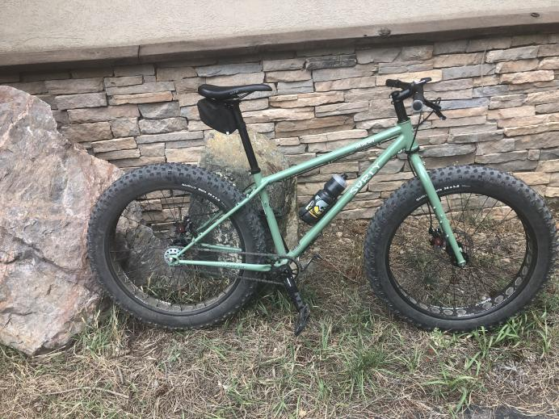

```{r setup, include=FALSE}
knitr::opts_chunk$set(echo = FALSE)
```

When I left RStudio a year ago to join Google Cloud my goal was to get exposure to other ways of being a sales engineer. This post recaps what I have learned and why I'm excited to be leaving Google for a sales engineering role at a new start up, [Elementl](https://elementl.com).

I think it might be helpful to have a brief timeline of the past year:  

- October-Nov: Ramping within Looker, which was still mostly independent.  
- Nov-Dec: Running the Looker SE process.  
- Jan: Re-org. Looker integrated with GCP, I land in a SMB COE. 
- Jan-Mar: Running the Looker SE process, but with new team.  
- Apr-June: Paternity leave.  
- June - Oct: Moved to enterprise GCP as a regional Looker specialist. Mostly running the GCP SE process.

## Outside Work

The biggest part of 2022 was becoming a new father. I am grateful to Google and my managers for allowing me to take 12 weeks of leave. I don't like to post photos of my daughter publicly, so instead:  

```{r}

```

The second biggest part of 2022 was re-discovering mountain biking, which led to me selling my old college mountain bike (codename: "Charlie"), and buying a ridiculous Surly Wednesday. So slow. So fun. 

## Looker Lessons

Looker ran an incredibly tight sales team that was a great example of value oriented selling. They also built ramp, tools, and processes that executed their strategy. The Looker process included:  

- Initial discovery call and demo. AEs led discovery using a value-driven markitecture slide.  
- The demo told a story using realistic data.  
- Customer PoCs would be done with a real Looker instance and followed a highly structured process incl:  
- Trial kickoff where a mutual evaluation plan was scoped and co-written in a doc. 
- Co-dev sessions where a Looker SE would write code and build dashboards alongside the prospect Progress was tracked in the evaluation plan.  
- Once the deal was closed the PoC would become production.  
- Throughout the trial AEs managed give/gets, ensuring each RFP or additional codev session was tied to information about the prospect's buying process.

Looker was licensed as a SaaS offering where pricing was platform and user based. The pricing was typically custom based on the customer.

## Google Cloud Lessons

Google Cloud was an entirely different beast. I was a data analytics specialist, an overlay to the GCP account teams who sold the entire GCP portfolio. (Actually I was a Looker specialist so I was an overlay to the DA overlay). If Looker was about value selling, GCP was about solution selling which meant:  

- Account team would meet to prepare a potential solution pitch for a customer, often something as broad as "better marketing analytics".  
- We'd meet with the customer, usually with pretty high level stakeholders, and present the pitch. Often we led with the Google brand, the benefits of GCP, and then the solution. Occasionally we would do a brief demo.
- Afterwards, we'd iterate on further pitches and demos usually with lower level stakeholders.  
- Normally POCs or even custom demos would be done by a partner funded by GCP.  

This process was sometimes done with greenfield accounts but was often done within existing GCP accounts. There were two goals: to secure a commit and then to turn that commit into revenue by driving workload consumption.

It was not uncommon to have 10-20 people involved in a GCP opportunity in one form or another, and as an overlay overlay I usually spent 2-3 weeks with these teams before moving on.

GCP is massive. Their systems are massive. But I did enjoy a few tools:  

- Google runs its own version of Google on all of their internal sites, docs, etc and it makes it really easy to find information - and also really easy to go down rabbit holes investigating cool things totally removed from your work, like borg.

- Google has a special internal short link system that makes it easy to give memorable links to content. These go/ links are used extenisvely.

Our office had a breakfast and lunch each day (Indian food and bacon were my highlights), a bike shop, a climbing wall, pinball, a barista, and fully stocked kitchens with snacks. Most people didn't come in daily, and after the January re-org my "teams" were all based throughout CA.

In addition to the sales process I got exposed to GCP's take on IAM, cloud consoles, and their crown jewel: BigQuery.

## I'd like to Thank...

In no particular order  

- Kate, who was my Looker mentor and taught me to give even better demos  
- Alex, who goes to the office everyday, and is always available to hash out a problem  
- Hutch, who was my first Looker hiring manager and had the best manager quality: absorbing not amplifying anxiety  
- Alyx, who gives the best executive demos  
- Scott, who was my manager in GCP and is authentic, genuine, and optimistic  
- Luka, who put up with my questions about react  
- Quynh, a CE onboarding buddy and sounding board for GCP madness  
- Dave, Rob, Tom B, AEs who taught me the ropes of Looker's deal pursuit  

## Elementl 

So what's next? I'll be joining Elementl as their first SE. I am excited to be back at a small startup where the sales strategy, pitch decks, and demos still need to be built. I'm also really excited about the [technology](https://github.com/slopp/snowreport). At Google I enjoyed getting more hands on with SQL running Looker plays. GCP sales, on the other hand, covers so many tools it's impossible to have more than a shallow understanding of each. I'm looking forward to being back in the trenches selling, but also writing Python and wrangling Kubernetes. Elementl is a good fit for me because it is a technical sale to technical personas, with a small sharp team, built around a bottom's up sales process.

I am grateful to have "double-dipped" and learned from both Looker and GCP. I am also grateful for a slower year with time off to start learning how to be a father. While it is hard to leave the security and comfort and food of Google, for now I am looking forward to going back to startup "time". Maybe I'll return to the behemoth one day, but till then, thanks fellow Googlers!