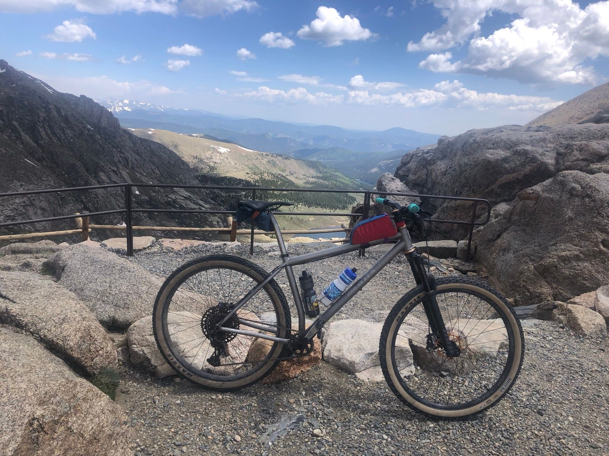
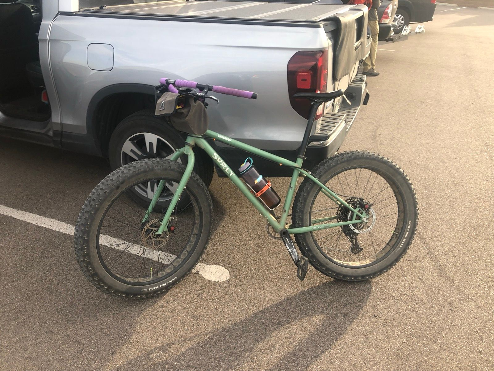
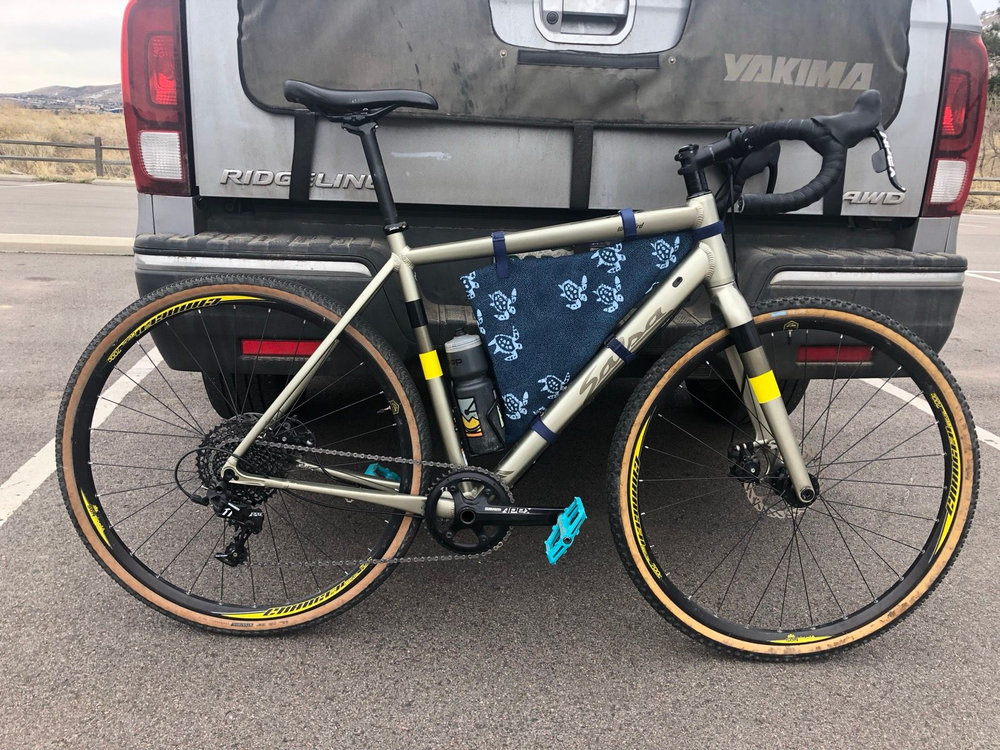
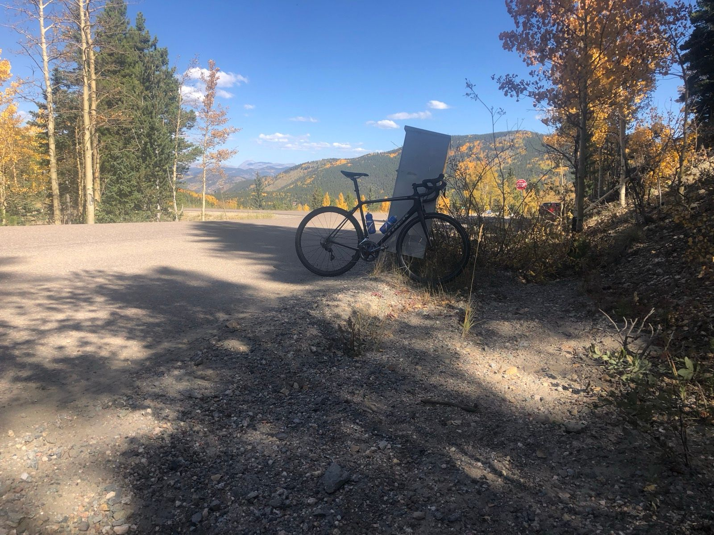

The brief history of my time riding bikes:

- *Age 7ish?* First bike was a blue Trek mountain bike from a garage sale. It was too big, and then very quickly too small.\
- *Age 9ish?* Second bike was a purple Trek mountain bike. 12 speed. Super cool bike, great for racing circles at Cub Scout camp outs. 
- *Age 12ish* Third bike was a Trek mountain bike. First brand new bike. First bike with front coil suspension (still rim brakes). Rode with cousins on real mountain bike trails. Lots of loops around the block with Dad. Rode my first 50 miler on this bike to get my cycling merit badge (from Keystone to Breckenridge and back via Frisco). This thing shredded.
- *Age 15ish* Fourth bike was my first 29er, some sort of Raleigh. Disc brakes (still coil shock and 3x upfront). I finally stopped growing, and this bike was in my stable the longest of any bike (so far), not sold until summer 2022 at age 28... thats 13 years! This bike's most notable accomplishment was being used as a college commuter where it was stored outside for 3 years and then never. maintained. again.
- *Age 17ish* Fifth bike was a Raleigh road bike. Also kept a long time (until at least summer of 2018). Most notable for riding hot laps around the neighborhood in high school, and doing some bigger rides in Summit County. First bike with clip pedals (added in 2013) and first bike to take me to the top of a 14tner. 

Riding bikes was pretty much a constant from about 2nd grade until I graduated college. There was a brief dark period after college where I rode very little (2015-2017). I picked things back up in 2018 when I went on a spending spree: 

- *2018 (now age 24)* Sixth bike was a Salsa Warbird. First Strava bike. First 2000+ mile bike (though who knows about the earlier ones). First bike where I started to do my own maintenance (and this bike has the scars... I scrapped the inner chainstay before I knew how to take a wheel on and off, both water bottle cages are held on by zip ties since I stripped the bolts, chain, chain ring, BB, cassette have all been replaced, and the right hood doesn't really stay on after a few crashes and an Apex shifter replacement). 

- *2019* Seventh bike was a Trek Emonda SL6 Pro. This bike was bought to chase Strava segments, especially hill climbs. This bike holds the records for two of my bucket list rides (Golden to top of Evans in 2020, Triple Bypass in 2021).

- *2022* Eighth bike was a Surly Wednesday (quasi steel fat bike, rigid, with 26x3.8 tires). I would say this purchase started my "bike enlightment" phase, which was (is) a period where I started consuming excessive amounts of bike media: The Radavist, Seth's Bike Hacks, Bikepacking.com, The Ride with Ben Delaney, etc. The Wednesday was also my first foray back into mountain biking, motivated by (a) disdain for roads (b) a move to Evergreen where gravel was less available. In 2020/2021s I had tried an indoor trainer and hated it. The Wednesday became my first foray into biking year round (aside from college commuting). For awhile I went full on "anti-establishment": forgoing lycra, riding without a Garmin or Strava. Winter 2022-summer 2023 it was run single speed. The bike is currently very close to its original form (geared, flat bar) but in the summer it serves duty as a Dad bike with jones bars and a seat.

- *Summer 2023* Ninth bike was a Surly Karate Monkey. First modern hard tail, first air suspension fork. First dropper. First 27in+ bike. This bike was a ton of fun, but it was also heavy AF. I bought it to both try and level up my mountain biking skills (this did not work) and try to do longer mixed rides instead of driving the Surly Wednesday to the trail heads (this also did not really work). However, this bike did shred, especially at Abasin which is probably my most "enduro" descent.

- *Winter 2023* Tenth bike was _the dream bike_ a Moots Womble. A 29er with SRAM GRX, downcountry geo, and _no dropper_. I traded cash + the Surly KM for it. Why was this the dream bike? I had my eyes on Moots for a long time (honestly just intrigued by the price tag) and The Radavist told me that the Womble was the ultimate hardtail experience and the ultimate application of Ti (the ultimate bike material). This used Womble was about 50% of a new one. Was any of it true? The bike is light. It is also very fun, and the geo feels very intuitive both on and off trail It is not quite as capable as the dropper-equipped 27.5+ KM at the Abasin descent, but it is close to the perfect bike for riding neighborhood roads to the beaver brook watershed trail (a roughcut blue-ish trail that is do-able on a gravel bike but more fun on a hardtail). When I originally bought it I had wanted a n=1 quiver killer. Since then, I've learned that even a light hardtail really can't compete with a dropbar bike for road/gravel - especially if you want to go fast. Do I want to go fast? TBD

- *2024* No bike purchases (yet)! This year is the first time I've really tried to ride my bike every day. With 6 weeks left in the year I'm at about 2,750 miles ridden, and 290 hours. Short of my New Year's goal of 1 hour per day, but still my most rides/hours on a bike ever! (My mileage is less than my 2020 PR of 2950 miles... but perhaps surpassable in 6 weeks time). Over the course of this year the pendulum has swung back a bit from "alt cycling" Sean... I now ride with my Garmin, with a power meter, and I did 3 drop bar rides this year that were all excellent and even in Spandex! Other highlights from this year include: learning how to track stand, a trip to New Mexico with Mootsy in tow, and a very memorable ride around Keystone where I fell and was fully submerged in a mountain creek. 

So what is next?

I would like to do more events in 2025, with my eyes on Old Man Winter, FoCo Fondo, and perhaps one of the Rambler endurance XC MTB events. I am trying to decide if I want to find group rides/biking friends ... as almost all of my cycling journey has been solo (apart from my Dad!). 

A few other musings...

- I have definitely improved as a mechanic. I can now pretty reliably swap chains, brake pads, bars, stems, cassettes, and tubeless tires. I can even straighten derailer hangers and do a decent job tuning gears. In 2024 I did my first 3 attempts a brake bleeds with some succes. I've also successfully removed and re-installed the cranks and BB on Wednesday. I don't really understand wheel truing, or want to touch bearings (the bearings in Wednesday's headset are quasi-exploded from the time I accidentally removed the fork). 

- I've gone through a LOT of variations on how to carry stuff on the bike. Handlebar bags, frame half bags, top tube bento box, jersey pockets, seat bags, and fanny pack. I don't really know. I prefer the aesthetic of a bike without bags. I also prefer not carrying things on my back. What to do? 

- I have also gone through a lot of variations on nutrition. I am pretty happy where I landed recently, which is riding with water bottles filled with drink mix. I used to do a lot of on-bike food (gummy worms) and during my alt-cycling phase I did a lot of "stop and eat". I like the current setup because it has prevented bonks while still allowing a high ratio of moving time to ride time.

What is the point of this post? I don't know. To document my cycling vibe at the current moment and maybe laugh at how that vibe has changed over time (mostly due to YouTube recommendations). 

So the bike check is... current stable: 

```{r}

```

```{r}

```

```{r}

```

```{r}

```
