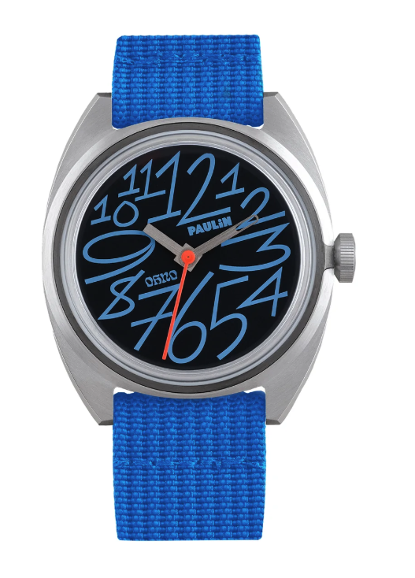

Today marks my last day at Dagster Labs and Monday will be my first day at Nvidia. It is a bittersweet change. The team at Dagster is truly impressive, and I am proud of what we've accomplished over the last 2.5 years. This post serves to be a reminder for both of those:

## Accomplishments

- Learning a lot more about data engineering including: dbt, dagster, ingestion (airbyte, fivetran, dlt) and concepts like partitioning, incremental loads, backfills  

- Getting better at Python: learning to use types, setting up VS code to be more helpful, writing classes, using function decorators, using "factory code" to build things more dynamically

I think the best "artifact" of this work is the [open source Dagster demo](https://github.com/dagster-io/hooli-data-eng-pipelines), and perhaps my capstone of "30 days of orchestration" video series.

- Selling! While I won't list the specifics here publicly, I am pretty proud to say that Dagster 10x'd revenue, added lots of reps, established a repeatable sales process, and regularly hit our quotas.

-  Building an awesome SE team...

## Team

In no particular order:

- Shaun was an incredibly talented manager, being a great example of "less is more" when done correctly. I also learned a ton about hiring from Shaun, including how to have an effective rubric for grading candidates, the importance of the "hype-up" hiring manager screen, and a great written exercise to screen SE candidates.

- Nick, Pete are both talented leaders who don't mind fuck you. This is basically my highest praise for executives.

- Izzy, Tom, and Christian were my immediate SE team and were incredible. A very humble, funny, kind, and "mellow" (in a good way) team. I especially appreicate Izzy's pizza recommendations and low key takes that were always right; Tom's dependability, and Christian's moments of "mad scientist" that were just brilliant. 

- Daniel (+Alex, Dish, Marco, Phil, Shalabh, Jordan) these guys are just hard core brilliant programmers who were also super humble, kind, and helpful. One thing that was amazing about Dagster is that no engineer ever said "thats not my problem", but this was especially true of these folks. I learned a lot about how to think of distributed systems, python stack traces, and the importance of proper SQL indexes. (Also shout outs to Ben, Chris, and Rex... who though younger, were equally brilliant and all did an amazing job thinking in terms of "whole product" experiences not just features.)

- Yuhan, Anna, Amy, Jacob, Eunice. These folks were the closest I've come to having middle-management peers, and I can genuinely say they each are the best at their craft of anyone I've met; with those crafts being: product, sales, customer success, finance, ops. Aside from the SEs, this group gave me the most laughs over the last 2 years and honestly thats the most important metric for me.

- Joe, Tim. Both of these fellows left Dagster before me, but stand out as true friends. Joe shared my passion for the outdoors, underbiking, and is a role model for staying true to one's self. Tim is southern kindness in its best form, and has some epic hot takes.

- Finally, Dagster had a great team of sales reps. Too many to name, and some I worked with only briefly. But I will call out Nash as someone who I expect to make it big.

## Next

So why join Nvidia? Well its an opportunity that is super hard to pass up. Re-uniting with some old colleagues, learning about a transformative technology, remote + comp. 

What is this transformative tech? As the past few posts and many gists have shown, I've started to wrap my head around LLMs. I don't think they will replace programmers, but I do seem them as almost a new "type" of function that is incredibly powerful and I excited to see what they enable. If we are truly close to crossing the bridge to physical systems... that woulds be monumental. For now, I am excited to have a LOT to learn (both about these models and GPU computing in general.) I am also excited to see how I adjust to "public company comp" as well as a role that is less directly in the trenches.

Last year I wrote the following about sales engineering. I think it still holds true, but for now I'm curious to see what the next chapter holds with a less known role.

```
My team is hiring a sales engineer!

Which might lead you to ask, what the heck is sales engineering?

If your company has ever considered onboarding a new software vendor, they’ve talked to a sales engineer. That’s the person who demos the product, answers technical questions, leads any proof of concept, and usually helps kickstart an implementation.

Why would (or wouldn’t) you want to be this person?

I started my career writing software. I enjoyed it, actually I enjoyed it too much. I was sort of like a video gamer, I would say things like “I’ll be done in an hour” and then 5 hours later I’d still be pushing commits trying to get one more error unblocked. I came home late and grouchy. Sales engineering gave me the huge dose of human empathy and encounter I needed on a regular basis to be a more balanced person while still scratching that technical itch.

You could say other roles provide that balance: engineering management, product management, even consultants. I enjoy sales engineering because it is competitive. It also doesn’t suffer from “OKR ambiguity”. You close deals, the business does well, you make money. It’s beautiful in both its simplicity and its challenge. In a startup, you get to be remarkably in tune with the health of the business, that gives you incredible leverage but it can also be a bit scary. Like any sales role, sometimes it comes down to a bit of luck, and sometimes that bad luck means you lose deals outside of your control. You get to meet a lot of interesting people and learn about how different teams do their work; unlike a consultant you’re not stressed about making every hour billable. Sometimes you do have to deal with difficult customers. 

Why would you want to be at Dagster Labs?

Dagster is a Python data orchestrator. This means you get to play with Python, dbt, Spark, CICD systems like GitHub actions, and Kubernetes. It is a blast. Some sales engineering roles are not that technical. This one is. If you want to sell data tools instead of giving demos about martech, cookie tracking, and ad conversion - this is the place. The company has a lot of things going for it that other data tooling startups don’t: the product actually exists, users enjoy it, and we know how to sell it for money. The team is also incredible. I’ve worked with lots of smart people, what is unique about Dagster Labs is that every seat on the bus has a smart person in it. A really smart person. And none of them are jerks.
```
